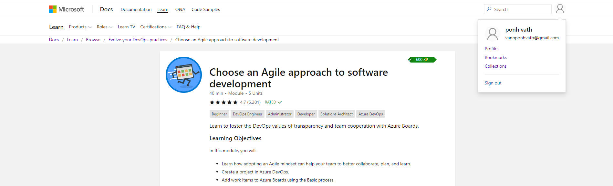

# MSA-Phase-2-Fullstack

- Front-End App: https://aboveyou.azurewebsites.net/
- Back-End App: https://above-backend.azurewebsites.net/swagger/index.html

### Advanced Requirements

- Relational Databases with relationships between tables
- Authentication (JWT)
- Responsive UI (Web + Mobile)
- Support translation
- Custom theme and logo
- Social Media Integration (Sharing content)
- Testing on Front-End with Jest and Enzyme
- Signal R (Attempted)

### Front-End Dependencies:

- React
- Typescript
- React Router
- Material UI
- Particles JS
- React-share
- i18next
- Enzyme
- Wow JS
- UUID
- React-Typed
- Axios

### Agile Module

